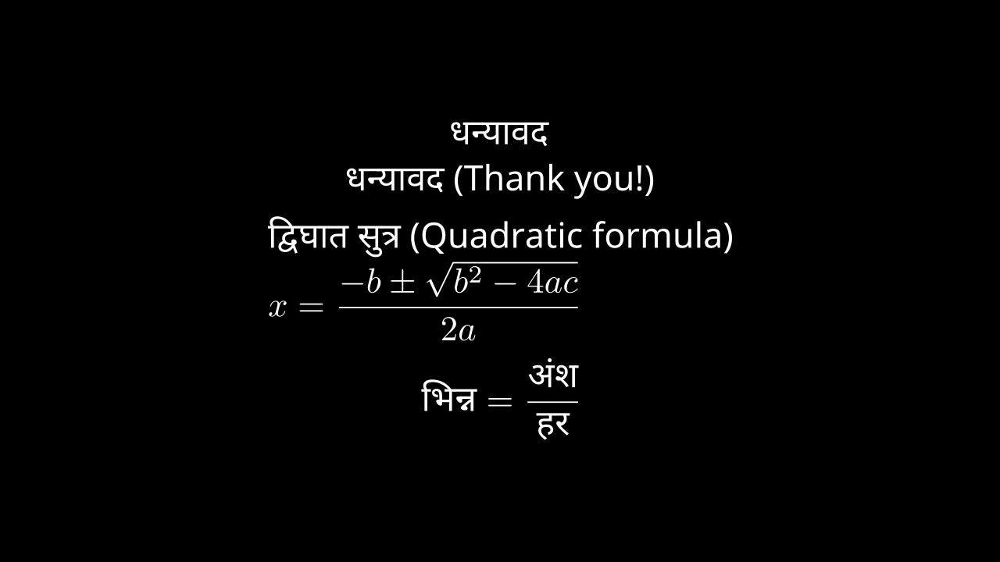

::: {.cell .code execution_count="1"}

:::

# Manim Devangari

Manim plugin for adding devanagari script.

# Table of Contents:

- [Manim Devangari](#manim-devangari)
- [Table of Contents:](#table-of-contents)
- [Installation](#installation)
- [Usage Devanagari](#usage-devanagari)
  - [Using Devanagari Template](#using-devanagari-template)
  - [Footer](#footer)
  - [Bold](#bold)
- [Theme](#theme)
- [Usage Notebook](#usage-notebook)
  - [Example 1](#example-1)
  - [Example 2](#example-2)
  - [Example 3](#example-3)
  - [Example 4](#example-4)
  - [Example 5](#example-5)

# Installation

- Install `pip install manim`
- Install font - `Noto Sans` and `Noto Sans Devanagari`

# Usage Devanagari

## Using Devanagari Template

```python
from manim import *
import manim_devanagari as m_deva
```

Supported Hindi, English and Math

```python
class Deva_1_Template(Scene):
    def construct(self):
        dev_tex = VGroup(
            Tex("धन्यावद", tex_template=m_deva._Devanagari),
            Tex("धन्यावद (Thank you!)", tex_template=m_deva._Devanagari),
            Tex(r"द्विघात सुत्र (Quadratic formula) \\ $x = \dfrac{-b \pm \sqrt{b^2 - 4ac}}{2a}$", tex_template=m_deva._Devanagari),
            MathTex(r"\text{भिन्न} = \dfrac{\text{अंश}}{\text{हर}}", tex_template=m_deva._Devanagari)
        ).arrange(DOWN)

        self.add(dev_tex)
```


```python


class Deva_2_MObject(Scene):
    def construct(self):
        dev_tex = VGroup(
            m_deva.Deva_Tex("धन्यावद", font_size=DEFAULT_FONT_SIZE),
            m_deva.Deva_Tex("धन्यावद (Thank you!)", font_size=DEFAULT_FONT_SIZE),
            m_deva.Deva_Tex(r"द्विघात सुत्र (Quadratic formula) \\ $x = \dfrac{-b \pm \sqrt{b^2 - 4ac}}{2a}$", font_size=DEFAULT_FONT_SIZE),
            m_deva.Deva_MathTex(r"\text{भिन्न} = \dfrac{\text{अंश}}{\text{हर}}", font_size=DEFAULT_FONT_SIZE)
        ).arrange(DOWN)

        self.add(dev_tex)
```



```python

class Deva_3_CancelMath(Scene):
    def construct(self):
        cancel_tex = VGroup(
            m_deva.Deva_MathTex(r"{{(1 + x)",r"(2 - x^2)}",r"\over",r"{(1 + x)}}", font_size=DEFAULT_FONT_SIZE),
            MathTex(r"{{(1 + x)",r"(2 - x^2)}",r"\over",r"{(2 - x^2)}}")
        ).arrange(DOWN)

        self.add(cancel_tex)
        self.add(m_deva.Cancel(cancel_tex[0][0]))
        self.add(m_deva.Cancel(cancel_tex[0][3]))

        self.add(m_deva.Cancel(cancel_tex[1][1]))
        self.add(m_deva.Cancel(cancel_tex[1][3]))
```


## Footer

```python

class Deva_4_SpecialText(Scene):
    def construct(self):
        footer = m_deva.Footer()
        cancel_tex = VGroup(
            m_deva.QuestionText(1, font_size=DEFAULT_FONT_SIZE),
            m_deva.SolutionText(font_size=DEFAULT_FONT_SIZE),
            m_deva.AnswerText( font_size=DEFAULT_FONT_SIZE)
        ).arrange(DOWN)
        self.add(cancel_tex, footer)
```


```python

class Deva_5_Footer(Scene):
    def construct(self):
        footer = m_deva.Footer(self.camera.frame_width)
        cancel_tex = VGroup(
            m_deva.QuestionText(1, font_size=DEFAULT_FONT_SIZE),
            m_deva.SolutionText(font_size=DEFAULT_FONT_SIZE),
            m_deva.AnswerText( font_size=DEFAULT_FONT_SIZE)
        ).arrange(DOWN)
        self.add(cancel_tex, footer)
```


## Bold

```python

class Deva_6_Bold(m_deva.Themes):
    def construct(self):
        self.set_theme(background_color=WHITE)
        cancel_tex = VGroup(
            m_deva.QuestionText(1, font_size=DEFAULT_FONT_SIZE),
            m_deva.BoldTex("Hello World!"),
            m_deva.Tex("Hello World!")
        ).arrange(DOWN)
        self.add(cancel_tex)
```


# Theme

```python

class Deva_7_Theme(m_deva.Themes):
    def construct(self):
        self.set_theme(background_color=WHITE)
        cancel_tex = VGroup(
            m_deva.QuestionText(1, font_size=DEFAULT_FONT_SIZE),
            m_deva.SolutionText(font_size=DEFAULT_FONT_SIZE),
            m_deva.AnswerText( font_size=DEFAULT_FONT_SIZE)
        ).arrange(DOWN)
        self.add(cancel_tex)
```


# Usage Notebook

```python
from manim import *
from manim_devanagari.notebook import Notebook, cue_column, Question, Answer, Solution
```

## Example 1

Only String value

```python
class Notebook_0(Scene):
    def construct(self):
        Text.set_default(font_size=10, font="Noto Sans")
        Paragraph.set_default(font_size=10, font="Noto Sans")
        MathTex.set_default(font_size=10)

        m = Notebook(
            cue_column("Question 1 :"),
            "What is motion?",
            cue_column("Answer :"),
            "Motion is the change in position of an object over time.",
            r"$$v = \dfrac{d}{t}$$",
            cue_column("Question 2 :"),
            "What is force?",
            cue_column("Answer :"),
            "Force is an interaction that causes an object to change its velocity, direction, or shape. It is a vector quantity, meaning it has both magnitude and direction.",
            r"$$F = m \cdot a$$",
            cue_column("Question 3 :"),
            "what is sound?",
            cue_column("Answer :"),
            "Sound is a form of energy that travels as vibrations through a medium, such as air, water, or solids, and is perceived by our ears as auditory sensations.",
            cue_column("Question 4 :"),
            "what is speed?",
            cue_column("Answer :"),
            "Speed is the distance traveled per unit of time. The formula for speed is:",
            r"$$\text{Speed} = \dfrac{\text{Distance}}{\text{Time}}$$",
            "where speed is measured in units such as meters per second (m/s) or kilometers per hour (km/h).",
        )

        self.add(m)
```


```python


class Notebook_1(Scene):
    def construct(self):
        Text.set_default(font_size=10, font="Noto Sans")
        Paragraph.set_default(font_size=10, font="Noto Sans")
        MathTex.set_default(font_size=10)

        m = Notebook(
            Question(1),
            "What is motion?",
            Answer(),
            "Motion is the change in position of an object over time.",
            r"$$v = \dfrac{d}{t}$$",
            Question(2),
            "What is force?",
            Answer(),
            "Force is an interaction that causes an object to change its velocity, direction, or shape. It is a vector quantity, meaning it has both magnitude and direction.",
            r"$$F = m \cdot a$$",
            Question(3),
            "what is sound?",
            Answer(),
            "Sound is a form of energy that travels as vibrations through a medium, such as air, water, or solids, and is perceived by our ears as auditory sensations.",
            Question(4),
            "what is speed?",
            Answer(),
            "Speed is the distance traveled per unit of time. The formula for speed is:",
            r"$$\text{Speed} = \dfrac{\text{Distance}}{\text{Time}}$$",
            "where speed is measured in units such as meters per second (m/s) or kilometers per hour (km/h).",
        )

        self.add(m)
```


## Example 2

```python


class Notebook_2(Scene):
    def construct(self):
        Text.set_default(font_size=10, font="Noto Sans")
        Paragraph.set_default(font_size=10, font="Noto Sans")
        MathTex.set_default(font_size=10)

        m = Notebook(
            cue_column("Question 1 :"),
            Text("What is motion?"),
            cue_column("Answer :"),
            Text(
                "Motion is the change in position of an object over time.",
            ),
            MathTex(r"v = \dfrac{d}{t}"),
            cue_column("Question 2 :"),
            Text("What is force?"),
            cue_column("Answer :"),
            Paragraph(
                "Force is an interaction that causes an object to change its velocity,",
                "direction, or shape."
                "It is a vector quantity, meaning it has both magnitude and direction.",
            ),
            MathTex(r"F = m \cdot a"),
            cue_column("Question 3 :"),
            Text("what is sound?"),
            cue_column("Answer :"),
            Paragraph(
                "Sound is a form of energy that travels as vibrations through a medium, such as air, water, or solids, and is perceived by our ears as auditory sensations."
            ),
            cue_column("Question 4 :"),
            Text("what is speed?"),
            cue_column("Answer :"),
            Paragraph(
                "Speed is the distance traveled per unit of time. The formula for speed is:"
            ),
            MathTex(r"\text{Speed} = \dfrac{\text{Distance}}{\text{Time}}"),
            Paragraph(
                "where speed is measured in units such as meters per second (m/s) or kilometers per hour (km/h)."
            ),
        )

        self.add(m)
```


## Example 3

```python


class Notebook_3(Scene):
    def construct(self):
        Text.set_default(font_size=10, font="sans-serif")
        Paragraph.set_default(font_size=10, font="sans-serif")
        MathTex.set_default(font_size=10)

        m = Notebook(
            Text("Question 1 :"),
            Text("What is motion?"),
            Text("Answer :"),
            Text(
                "Motion is the change in position of an object over time.",
            ),
            MathTex(r"v = \dfrac{d}{t}"),
            Text("Question 2 :"),
            Text("What is force?"),
            Text("Answer :"),
            Paragraph(
                "Force is an interaction that causes an object to change its velocity,",
                "direction, or shape."
                "It is a vector quantity, meaning it has both magnitude and direction.",
            ),
            MathTex(r"F = m \cdot a"),
            Text("Question 3 :"),
            Text("what is sound?"),
            Text("Answer :"),
            Paragraph(
                "Sound is a form of energy that travels as vibrations through a medium, such as air, water, or solids, and is perceived by our ears as auditory sensations."
            ),
            Text("Question 4 :"),
            Text("what is speed?"),
            Text("Answer :"),
            Paragraph(
                "Speed is the distance traveled per unit of time. The formula for speed is:"
            ),
            MathTex(r"\text{Speed} = \dfrac{\text{Distance}}{\text{Time}}"),
            Paragraph(
                "where speed is measured in units such as meters per second (m/s) or kilometers per hour (km/h)."
            ),
        )

        self.add(m)
```


## Example 4

```python


class Notebook_3(Scene):
    def construct(self):
        Text.set_default(font_size=10, font="sans-serif")
        Paragraph.set_default(font_size=10, font="sans-serif")
        MathTex.set_default(font_size=10)

        m = Notebook(
            cue_column("Q1."),
            Text("What is motion?"),
            Text("Answer :"),
            Text(
                "Motion is the change in position of an object over time.",
            ),
            MathTex(r"v = \dfrac{d}{t}"),
            cue_column("Q2."),
            Text("What is force?"),
            Text("Answer :"),
            Paragraph(
                "Force is an interaction that causes an object to change its velocity,",
                "direction, or shape."
                "It is a vector quantity, meaning it has both magnitude and direction.",
            ),
            MathTex(r"F = m \cdot a"),
            cue_column("Q3."),
            Text("what is sound?"),
            Text("Answer :"),
            Paragraph(
                "Sound is a form of energy that travels as vibrations through a medium, such as air, water, or solids, and is perceived by our ears as auditory sensations."
            ),
            cue_column("Q4."),
            Text("what is speed?"),
            Text("Answer :"),
            Paragraph(
                "Speed is the distance traveled per unit of time. The formula for speed is:"
            ),
            MathTex(r"\text{Speed} = \dfrac{\text{Distance}}{\text{Time}}"),
            Paragraph(
                "where speed is measured in units such as meters per second (m/s) or kilometers per hour (km/h)."
            ),
        )

        self.add(m)
```


## Example 5

```python


class Notebook_4(Scene):
    def construct(self):
        Text.set_default(font_size=10, font="sans-serif")
        Paragraph.set_default(font_size=10, font="sans-serif")
        MathTex.set_default(font_size=10)

        m = Notebook(
            cue_column("Question 1:"),
            Text("Which of the following are sets? Justify your answer."),
            cue_column("(i)"),
            Text(
                "The collection of all months of a year beginning with the letter J.",
            ),
            cue_column("Soluton :"),
            Paragraph(
                "The collection of all months of a year beginning with the letter J is a well-defined",
                "collection of objects because one can definitely identify a month that belongs to this collection.",
                "Hence, this collection is a set."
            ),
            cue_column("(ii)"),
            Text("The collection of ten most talented writers of India."),
            cue_column("Soluton :"),
            Paragraph(
                "The collection of ten most talented writers of India is not a well-defined collection",
                "because the criteria for determining a writer’s talent may vary from person to person."
                "Hence, this collection is not a set.",
            ),
            cue_column("(iii)"),
            Text("A team of eleven best-cricket batsmen of the world."),
            cue_column("Soluton :"),
            Paragraph(
                "A team of eleven best cricket batsmen of the world is not a well-defined collection",
                "because the criteria for determining a batsman’s talent may vary from person to person.",
                "Hence, this collection is not a set."
            ),
            cue_column("(iv)"),
            Text("A team of eleven best-cricket batsmen of the world."),
            cue_column("Soluton :"),
            Paragraph(
                "The collection of all boys in your class is a well-defined collection because you can",
                "definitely identify a boy who belongs to this collection.",
                "Hence, this collection is a set."
            ),

        )

        self.add(m)
```


